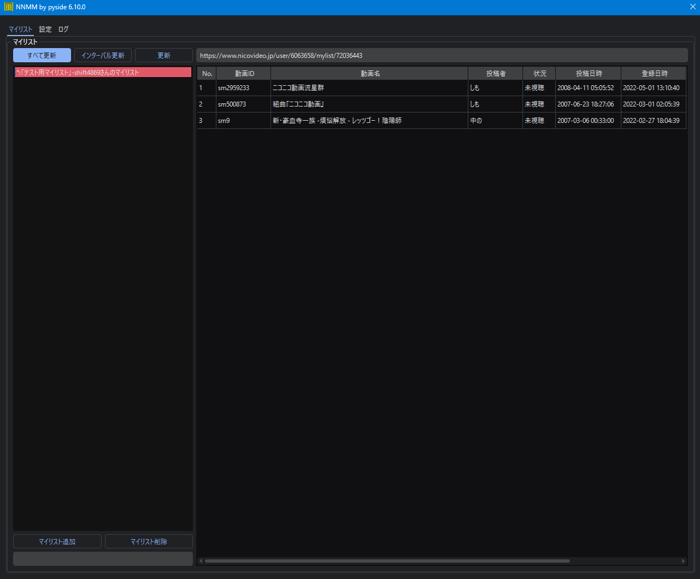

# NNMM

## 概要
NNMM = NicoNicoMylistManager  
特定のマイリストや特定の投稿者の投稿動画を一覧で管理するマネージャ

## 外観

## 特徴（できること）
- 機能
    - 特定のマイリスト一覧表示
    - 特定のユーザーの投稿動画を一覧表示
    - 一覧に未視聴動画が含まれる場合マーキング（背景色）
    - 未視聴動画にマーキング（「状況」項目）
    - ブラウザで動画ページを開く
    - マイリスト情報更新（特定/全て）
    - オートリロード
    - マイリスト検索
    - 動画情報表示

- 実装予定機能
    - シリーズ一覧表示

## 前提として必要なもの
- Pythonの実行環境(3.9以上)
- ニコニコのアカウント情報（今の所任意）

## 使い方
1. 右上のテキストボックス内に以下の形式のURLを入力する
    - マイリスト：https://www.nicovideo.jp/user/{user_id}/mylist/{mylist_id}
    - 投稿動画：https://www.nicovideo.jp/user/{user_id}/video
1. 左下のプラスマーク「+」を押して登録する
1. 右上の更新ボタンで更新する
    - マイリスト登録時に動画一覧が取得される
        - このときは内部ブラウザによるレンダリングにより100件まで動画をスクレイピングする
    - 以降はRSSで30件ずつ動画情報を取得する
1. 左側のマイリストペインから登録したマイリストをダブルクリックすると、取得した動画一覧が右ペインに表示される
1. 設定タブからオートリロードの設定等が可能
1. 左下のオールボタン「all」を押すと登録した全マイリストについて動画情報を更新する
1. マイリストペイン・動画一覧ペイン上で右クリックすることにより各種操作が可能

## License/Author
GNU Lesser General Public License v3.0（PySimpleGUIを使用している）  
Copyright (c) 2021 [shift](https://twitter.com/_shift4869)  

