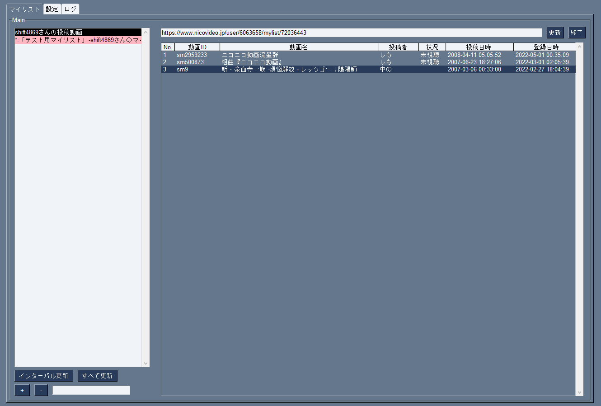

# NNMM

## 概要
NNMM = NicoNicoMylistManager  
特定のマイリストや特定の投稿者の投稿動画を一覧で管理するマネージャ

## 外観

## 特徴（できること）
- 機能
    - 特定のユーザーの投稿動画を一覧表示
    - 一覧に未視聴動画が含まれる場合マーキング
    - 未視聴動画にマーキング
    - ブラウザで動画ページを開く
    - マイリスト情報更新（特定/全て）
    - オートリロード

- 実装予定機能
    - 動画情報表示
    - 特定のマイリスト一覧表示
    - シリーズ一覧表示

## 前提として必要なもの
- Pythonの実行環境(3.9以上)
- ニコニコのアカウント情報（今の所任意）

## 使い方
1. 後で追記

## License/Author
GNU Lesser General Public License v3.0　になる予定（PySimpleGUIを使うので）  
Copyright (c) 2021 [shift](https://twitter.com/_shift4869)  

