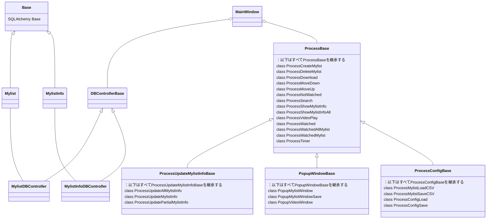

```mermaid
classDiagram
    class MainWindow

    class Base{
        SQLAlchemy Base
    }
    class Mylist
    class MylistInfo

    class DBControllerBase
    class MylistDBController
    class MylistInfoDBController

    class ProcessBase{
        ：以下はすべてProcessBaseを継承する
        class ProcessCreateMylist
        class ProcessDeleteMylist
        class ProcessDownload
        class ProcessMoveDown
        class ProcessMoveUp
        class ProcessNotWatched
        class ProcessSearch
        class ProcessShowMylistInfo
        class ProcessShowMylistInfoAll
        class ProcessVideoPlay
        class ProcessWatched
        class ProcessWatchedAllMylist
        class ProcessWatchedMylist
        class ProcessTimer
    }

    class ProcessUpdateMylistInfoBase{
        ：以下はすべてProcessUpdateMylistInfoBaseを継承する
        class ProcessUpdateAllMylistInfo
        class ProcessUpdateMylistInfo
        class ProcessUpdatePartialMylistInfo
    }

    class PopupWindowBase{
        ：以下はすべてPopupWindowBaseを継承する
        class PopupMylistWindow
        class PopupMylistWindowSave
        class PopupVideoWindow
    }

    class ProcessConfigBase{
        ：以下はすべてProcessConfigBaseを継承する
        class ProcessMylistLoadCSV
        class ProcessMylistSaveCSV
        class ProcessConfigLoad
        class ProcessConfigSave
    }

    MainWindow o-- DBControllerBase
    MainWindow o-- ProcessBase

    Base <|-- Mylist
    Base <|-- MylistInfo
    DBControllerBase <|-- MylistDBController
    DBControllerBase <|-- MylistInfoDBController
    Mylist -- MylistDBController
    MylistInfo -- MylistInfoDBController

    ProcessBase <|-- ProcessUpdateMylistInfoBase
    ProcessBase <|-- PopupWindowBase
    ProcessBase <|-- ProcessConfigBase
```