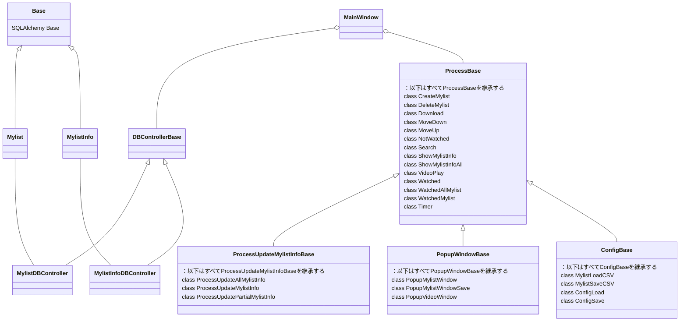

```mermaid
classDiagram
    class MainWindow

    class Base{
        SQLAlchemy Base
    }
    class Mylist
    class MylistInfo

    class DBControllerBase
    class MylistDBController
    class MylistInfoDBController

    class ProcessBase{
        ：以下はすべてProcessBaseを継承する
        class CreateMylist
        class DeleteMylist
        class Download
        class MoveDown
        class MoveUp
        class NotWatched
        class Search
        class ShowMylistInfo
        class ShowMylistInfoAll
        class VideoPlay
        class Watched
        class WatchedAllMylist
        class WatchedMylist
        class Timer
    }

    class ProcessUpdateMylistInfoBase{
        ：以下はすべてProcessUpdateMylistInfoBaseを継承する
        class ProcessUpdateAllMylistInfo
        class ProcessUpdateMylistInfo
        class ProcessUpdatePartialMylistInfo
    }

    class PopupWindowBase{
        ：以下はすべてPopupWindowBaseを継承する
        class PopupMylistWindow
        class PopupMylistWindowSave
        class PopupVideoWindow
    }

    class ConfigBase{
        ：以下はすべてConfigBaseを継承する
        class MylistLoadCSV
        class MylistSaveCSV
        class ConfigLoad
        class ConfigSave
    }

    MainWindow o-- DBControllerBase
    MainWindow o-- ProcessBase

    Base <|-- Mylist
    Base <|-- MylistInfo
    DBControllerBase <|-- MylistDBController
    DBControllerBase <|-- MylistInfoDBController
    Mylist -- MylistDBController
    MylistInfo -- MylistInfoDBController

    ProcessBase <|-- ProcessUpdateMylistInfoBase
    ProcessBase <|-- PopupWindowBase
    ProcessBase <|-- ConfigBase
```