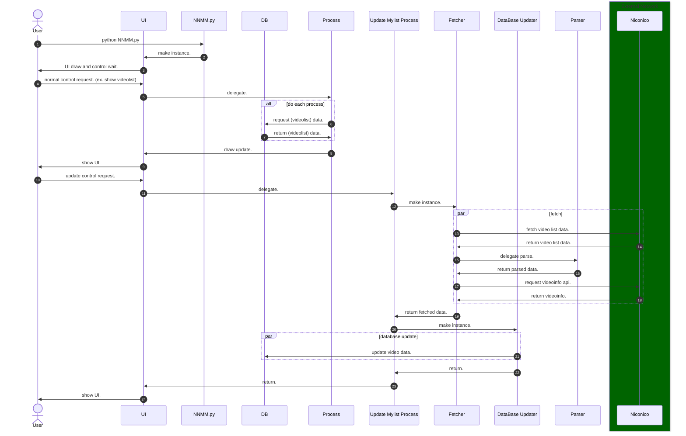

```mermaid
sequenceDiagram
    autonumber

    actor user as User
    participant ui as UI
    participant main as NNMM.py
    participant db as DB
    participant process as Process
    participant update_mylist as Update Mylist Process
    participant fetcher as Fetcher
    participant database_updater as DataBase Updater
    participant parser as Parser

    box DarkGreen External Network
    participant niconico as Niconico
    end

    user ->> main: python NNMM.py
    main ->> ui : make instance.
    ui ->> user : UI draw and control wait.

    user ->> ui : normal control request. (ex. show videolist)
    ui ->> process : delegate.
    alt do each process
        process ->> db : request (videolist) data.
        db ->> process : return (videolist) data.
    end
    process ->> ui : draw update.
    ui ->> user : show UI.

    user ->> ui : update control request.
    ui ->> update_mylist : delegate.
    update_mylist ->> fetcher : make instance.
    par fetch
        fetcher ->> niconico : fetch video list data.
        niconico ->> fetcher : return video list data.
        fetcher ->> parser : delegate parse.
        parser ->> fetcher : return parsed data.
        fetcher ->> niconico : request videoinfo api.
        niconico ->> fetcher : return videoinfo.
    end
    fetcher ->> update_mylist : return fetched data.
    update_mylist ->> database_updater : make instance.
    par database update
        database_updater ->> db : update video data.
    end
    database_updater ->> update_mylist : return.
    update_mylist ->> ui : return.
    ui ->> user : show UI.
```